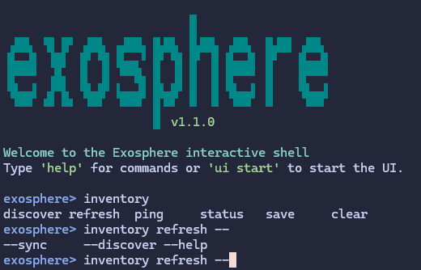

# 1.1.0 - The Fancy CLI Release

*Released August 01, 2025*

After spending the last weeks before 1.0 polishing up the TUI, the Interactive command line interface was in dire need of some love.
At the center of this release is a brand new, improved interactive CLI component and improved error reporting.

## Highlights

### A brand new REPL Module

Previously, the interactive shell, or REPL for Exosphere was provided by a quick hack around click_shell, in order to get the hierarchy going quickly. The experience it provided wasn't up to scratch, and functionality depended on platform. Not to mention, a bunch of horrifying compatibility hacks were added to ensure basic feature parity on Windows.

All of this has been completely replaced with a brand new, purpose built REPL module! Some exciting features include:

* Readline-style Tab Completion down to individual options for each command and subcommand
* Persistent history and reverse search (ctrl+r)
* Completely multi-platform (linux, unix, mac, windows), pure Python, with no dependencies on readline
* Improved colors and general presentation
* Much improved subcommand error handling
* A few built-in commands, all documented

### Much Improved error reporting

The `discover` command, both at inventory and host level, will now clearly report authentication issues, allowing for a much smoother first experience when adding hosts to the inventory. Apologies to people who had to look at the logs previously and furrow their brows at less than useful error messages written in SSH Library Speech.

The documentation has also been refreshed to cover this very topic, which hopefully should make onboarding much smoother.

### Dependency Slimming

The Web UI component of Exosphere is mostly experimental, and more of a curiosity than Generally Helpful, and burdening every install with its large stack of dependencies felt rude, so it has been made completely opt-in.

By default, it will not be installed, but you can very easily add it back by installing `exosphere-cli[web]`, as an extra.

Finally, on a personal note, seeing other people get use out of my silly little piece of software has brought immense joy to my cold, bitter, industry veteran heart. If you sent any sort of experience report, thank you. If you didn't, thank you all the same. <3

## What's Changed

* Replaced click_shell with new, purpose built REPL module
* Make WebUI Dependencies Optional
* Massively improve error reporting for discovery
* Refresh documentation with new features
