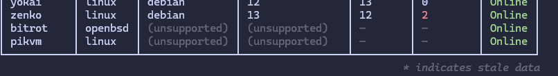

# 1.3.0 - Supporting the Unsupported Release

*Released August 20, 2025*

## Exosphere now supports keeping unsupported hosts in the inventory

The main major feature of this release is the ability to add unix-like systems that do not have a package manager Provider available to the inventory. This allows the connectivity checks to function, and the hosts to show up on the dashboard, but you will not be able to perform package refresh and repository syncs on them.

A recurring piece of user feedback has been the expectation that unsupported hosts in the inventory that pass the Online check should not suddenly turn Offline when the discovery process identifies them as unsupported. This feature update now resolves this, and we now officially support this scenario! The UI (cli commands and TUI both) will properly accommodate them as well, marking them explicitly as unsupported, and will not attempt to display Update counts or stale indicators for them.

Note that this is still limited to Unix-like, or at least Reasonably POSIX Compliant hosts. Other proprietary platforms where SSH is available (i.e. Network equipment, Windows hosts with sshd that does not lead to WSL, etc) will simply not be supported at all, and the discovery process will report them as such, encouraging you to remove them from the inventory.

## Upgrade Notes

**There are two important notes** if you are upgrading from 1.2.0 or earlier:

* You should run `exosphere inventory discover` after upgrading to ensure unsupported hosts are correctly picked up, if you have any.
* We no longer support installation outside venvs via `pip`, as this is only a recipe for disaster, and unsupported in many distributions anyways. Consider installing via `pipx` or `uv tool` instead.

## New Features

* Support for unsupported hosts in the inventory. Unsupported Unix-like hosts are now allowed in the inventory to still benefit from the dashboard and online checks (#36)
* Configuration file validation improvements: hosts missing critical fields will now be correctly reported on startup
* Discovery process has been overhauled further to now report useful errors to users and avoid confusion and further distinguish Authentication errors from other types of failure cases. 
* Error messages have been improved as per user feedback.
* Documentation has been updated to reflect these changes, and improved in many parts.

## Bugfixes

* Filter out `@` from the `ip` field in the hosts section of the configuration, to avoid undefined connection behaviors with the underlying SSH libraries (#50)
* Redhat Provider: Prevent duplicate updates from being reported in some configurations
* Redhat Provider: Correctly report Kernel updates in spite of DNF not considering those updates in most configurations (#48). We now abstract this and present them as upgrades as that is more consistent with expectations from a UX standpoint.

## Misc

* Internal command for SSH ping test has been changed to POSIX `true` instead of some flaky `echo`. This allows us to further distinguish specific failure cases in future iterations, while ensuring minimal POSIX compatibility for hosts.
* Removed old compat module, unnecessary since switch to our own REPL code.
* Dev dependencies updates
* Library updates in uv.lock (textual 5.3.0)
* Drop support for `pip install --user` as it only causes problems outside of venvs and is no longer possible on Debian out of the box.
