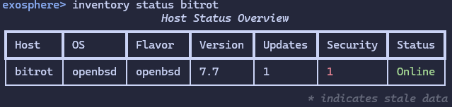

# 1.4.0 - OpenBSD Support

*Released September 13, 2025*

## Exosphere now fully supports OpenBSD as a remote platform!

The major feature in this release is the addition of a new `PkgAdd` provider, which targets OpenBSD remote systems.
If you add OpenBSD systems to your inventory, `discovery` should enumerate them fully and you will be able to perform
`refresh` actions on it, and obtain host details, just like any other supported remote Operating System.

## Notes

If you already have OpenBSD hosts in your inventory , and they have been discovered as `unsupported`, that state
will not automatically change. You must run `exosphere inventory discover` at least once after updating to 1.4.0 to
have them fully setup and integrated into exosphere.

By default, on a release or stable install, all package updates *are* Security Updates, by definition, and will show up
as such in Exosphere.

If you are running `-current` or `-beta`, the security status of package updates can't be ascertained and none of
them will show up as security updates.

## Special Thanks

Thanks to **Solène** (`@solene@bsd.network`) on the Fediverse for the helpful pointers regarding the
specific semantics of package updates on OpenBSD

## What's Changed

* Add OpenBSD Support
