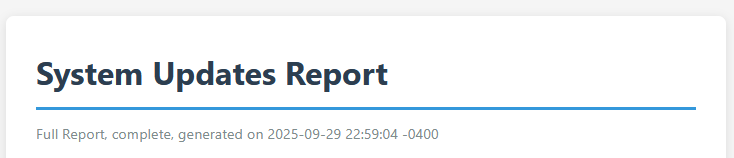
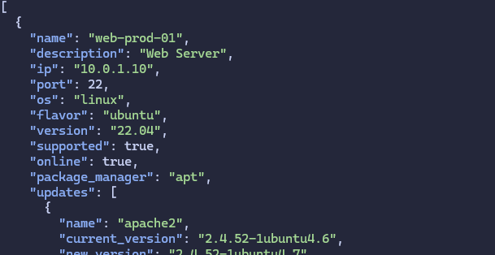
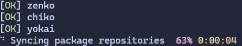

# 1.5.0 - The Reporting Update

*Released October 04, 2025*

## Exosphere can now generate reports

If you ever felt it was weird that a patch reporting tool could not actually produce reports you can print, email or otherwise use outside of the application, this update will likely please you.

Exosphere now provides a `report` command which allows you produce document based reports in **HTML, Plain Text and Markdown formats**, which should hopefully cover most use cases.

The reports can be filtered to include only a selection of hosts, updates only, or security only, and have a wealth of useful options.
Various in depth examples of the formats as well as copious details on usage can be found in [our ever growing documentation](../reporting.rst).

## Exosphere can now emit JSON with the current state

As part of the same feature, we now have a nice JSON report format available for programmatic consumption of the data and inventory state. It is simply treated as an extra format the reporting module can handle.

This should be helpful if you ever wanted to integrate Exosphere into something else, or feed the data that it generates into something else, ranging from a Discord bot to your event system for your overly complex Doorbell over zigbee MQTT system.

It's also reasonably helpful for use with [jq](https://jqlang.org/) to perform ad-hoc queries that Exosphere itself doesn't expose.

This feature is discussed in great detail, including a full definition of the JSON Schema, in {ref}`our ever growing documentation <json-schema>`.

## Version Check command

There is now a `version` command with a `check` subcommand that will query PyPI to tell you whether or not your version of exosphere
is up to date, and provide you with links to release notes and upgrade documentation if relevant.

We do not have automatic checks on startup or anything of that nature, it is strictly on-demand.
This feature can also be forcefully disabled via {ref}`the relevant configuration option <update_checks_option>` if necessary for your environment.

## Minor CLI improvements

- `inventory refresh` now has a `--verbose` option that will give you a host by host view of tasks as they complete, much like how `discover` does by default.
- Built-in help for commands options has been reworked to offer a more consistent view across subcommands.

## Changes in this Release

- Docs: Detail syspatch usage for OpenBSD provider
- Improve CLI help, add verbose switch to "inventory refresh"
- Use UTC timezone-aware datetime objects for host.last_refresh
- Add Reporting Feature
- Misc docs fixes
- Add sphinx-lint, poe task, linting pass
- Update FAQ Entry regarding OPNSense
- Add Version Check feature
- Library updates in uv lockfile, both for development and runtime
- Misc source tree cleanups
