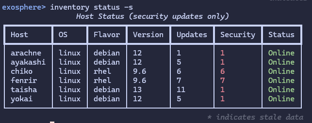

# v1.5.1 - Minor QoL Update

*Released October 10, 2025*

Minor point release introducing a small QoL improvement that is fully backwards compatible, as well as Python 3.14 uv housekeeping.

Exosphere now has the ability to filter inventory status output with `--updates-only` and `--security-only`, and it feels weird that it didn't from day one.

Documented in the {ref}`CLI section <viewing-inventory-status>`.

Additionally, the inventory being empty is now correctly considered an error case, and Exosphere commands will correctly return non zero exit when unable to perform their actions due to that scenario.

The lockfile for uv dependencies has been updated with a handful of dependencies that are either minor, or have explicit Python 3.14 support patches added in. We're preemptively adding them it for consistency and future compatibility tests.
