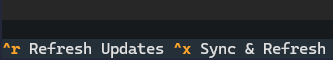
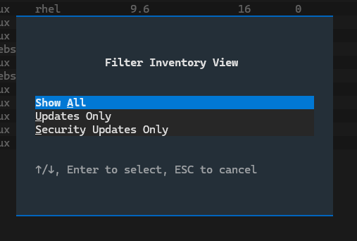
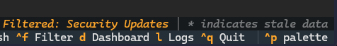
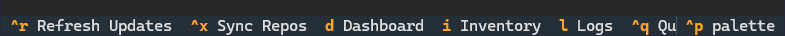
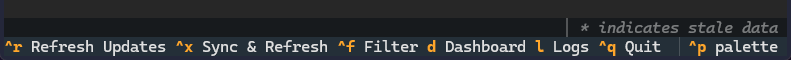
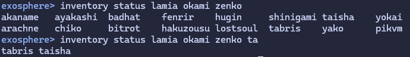

# 2.1.0 - The Big Quality Release

*Released November 01, 2025*

## Big Quality of Life Update

🎃 A spooky Halloween Release 🎃 

This update contains multiple long standing QoL changes that I have been wanting to put in for a while.
It is my hope that this makes the experience of using Exosphere more pleasant.

Let's go over the major ones:

### TUI Inventory Screen Features

`Sync Repos` as an action has been reworked into **Sync & Refresh**. When hitting `ctrl+x`, Exosphere will now do a repository sync followed by a refresh, as there was essentially no scenario in which you would just want a sync alone. This saves you the need to hit `ctrl+r` immediately after, as it will do it for you.

#### Filtering functionality on TUI Inventory Screen

You can now hit `ctrl+f` to filter the inventory view to only display hosts with updates, or hosts with Security Updates exclusively.
The CLI `inventory` command had this functionality for a while, and I strongly felt like the TUI one needed feature parity.

A status bar has been added at the bottom of the inventory screen which will inform you whenever the view is filtered in any way.

#### Themes Support

Most of the Textual CSS and Colors within the Exosphere TUI have been reworked to use generalized colors that honor the selected Color Theme. So you can now fully swap to your favorite using the appropriate Palette command, and Exosphere will absolutely respect it.

#### TUI navigation improvement

The bottom footer with navigation keybinds no longer shows the keybind for the screen you are currently on. This conserves screen real estate significantly, and prevents the menu from being overwhelming.

Additionally, the inventory screen now switches the layout of the footer to a more compact one to ensure it is legible on smaller terminal sizes.

**Before**:

**After**:

### REPL Improvements

In addition to a new shiny logo banner on startup ({ref}`which can now be disabled <no_banner_option>`, if you don't share my eclectic tastes in ascii art), the REPL has seen **massive** improvements to its tab completion features.

#### Host Completion

Exosphere in interactive mode can now tab complete **inventory hosts**, either as positional or option arguments.

This includes the expected readline-like double tab to show all possible matches features.

#### Better readline/shell-like completion flow

The Completion code has been refactored significantly to allow closer behavior to that of unix shells and readline in general.
More specifically, trailing spaces are appended after matches, and options that do not take arguments (i.e. `--sync`) will simply tab through, allowing you to tab complete lines at blazing speed, in a context sensitive way.

## What's Changed

* TUI: Improve Sync behavior on inventory screen
* TUI: Add Filtering functionality to Inventory screen
* UI: Improve footer usability
* REPL: Massively improve tab completion
* REPL: Prevent double completion in help full match
* Update REPL banner, add option to disable it entirely
* Misc docs and comments cleanup
* Fix documentation for default_sudo_policy
* Support Textual theme colors where possible
* Dashboard: add ~3chars tolerance in sizing columns
* Refresh documentation screenshots, README
* Bump version, update lockfile
