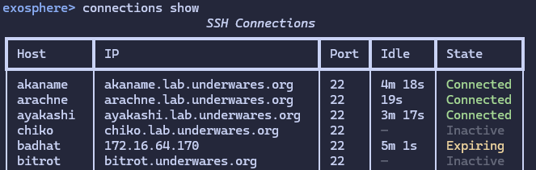

# 2.2.0 - SSH Pipelining and Spring Cleanup

## A polish pass and a feature

This release contains a hot new feature and a polish pass on the entire codebase, refactoring a lot of internal code that was either sub-par, or naively designed for simpler times back in 1.0, and had not been revisited since.

It's not spring, but spring cleaning is a state of mind, unbound to such trivial things as calendars.

## New Feature: SSH Pipelining

A new {ref}`opt-in configuration setting <ssh_pipelining_docs>` now allows you to leave SSH connections open between operations in Interactive (REPL) or TUI mode, which will allow Exosphere to reuse them, reducing connection open/close churn, and improving performance on larger inventories, or setups where the ssh negotiation part of the connection is particularly slow.

The connection will be closed after a {ref}`configurable idle time <ssh_pipelining_lifetime_option>` that defaults to 300 seconds.

This comes with a new REPL command, `connections` which will display the current state of any connection currently held open by Exosphere, as well as let you manually close them if that is something you want to do.

By default, the pipelining feature is disabled and the previous Exosphere behavior of closing connections after each operation remains unchanged.

However, some minor batching and optimizations have been done in the dispatch and provider code to ensure there is significantly less connection churn, batching all queries related to a single operation (sync, refresh, ping etc) within the same connection. Performance should be improved in general, even with pipelining disabled.

The choice of which mechanism is preferable is left entirely to the user.

## Internal refactoring and polish pass

A lot of the earlier code within Exosphere was designed around a much smaller, more naive ideal for how Exosphere should function. As the application grew and found its exact scope, a lot of these design decisions were mostly hacked around or left alone.

The primary one is the way the state cache (exosphere.db) is built and loaded. Several improvements have been done around the serialization machinery. The state of a Host object is now contained within a HostState dataclass that is easily serializable, with a proper version schema.

This allows us to ensure seamless migration of data between exosphere versions in a much cleaner way, replacing the series of horrifying serialization hacks we had previously to achieve this.

Migration to this new serialization format will be handled transparently by Exosphere, so there is no user action required. INFO level logs are produced on the initial conversion, but otherwise the cached state of your hosts should carry over.

Other than this, a lot of miscellaneous warts and unpleasant areas of the code that bothered the author for a while have been rewritten to be much, much nicer, with no user facing changes or differences. The UI code in particular had a lot of horrifying hacks removed, and duplicated code with subtle differences unified, resulting in a much cleaner code base.

## Dependencies changes

Some runtime libraries had their version constraints changed, for compatibility or security reasons:

* Typer>=0.20.0
* Textual>=6.7.0 (for new autosize grid components)
* pyyaml>=6.0.3
* rich>=14.1.0

## Bugfixes

* `cache_autopurge` option now correctly respects `cache_autosave` being false in configuration. This has been clarified in the documentation.

## What's Changed

* Docs: Add FAQ entry for dnf sqlite ro issues
* Feature: SSH Pipelining
* Refactor Host serialization and cache format
* REPL: Refactor host completion to be dynamic
* Misc internal fixes and cleanups
* Dashboard: Switch to ItemGrid container
* Internal UI refactors
* Minor Cleanups
