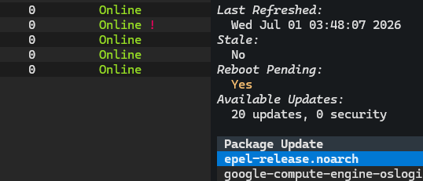
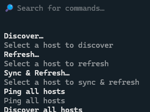
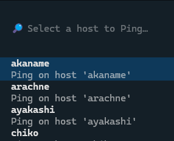
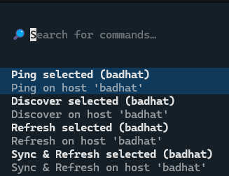
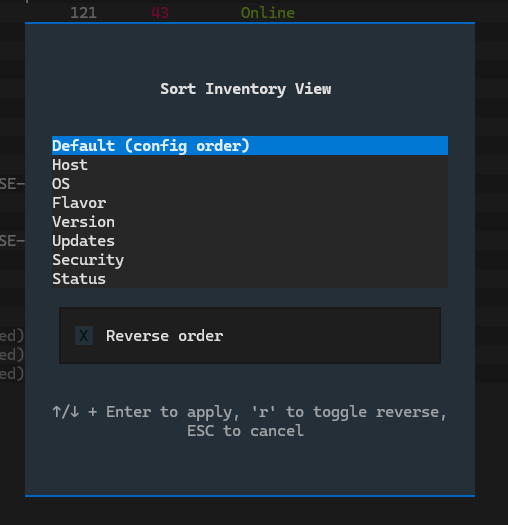
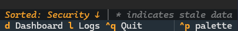
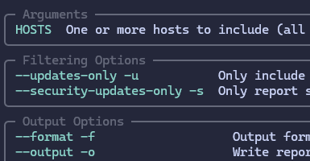
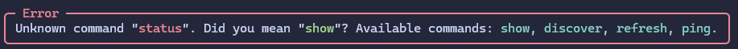

# 3.0.0 - Reboots, Palettes, Sorting and refreshed CLI

The first major version release actually backed by a major set of changes.
This release lands several long overdue features, refactors a lot of internals,
swaps out the entire CLI engine and provides a much more polished help and
documentation experience.

It has been cooking for a while, and the release notes are correspondingly long.
Most of these changes are transparent, but there are some unavoidable
incompatibilities. Make sure to read [User Actions Required](#user-actions-required)
and [Incompatible Changes](#incompatible-changes) before upgrading.

## Feature Highlights

### Pending Reboot Detection

Exosphere can now tell you when a host is waiting on a reboot to finish applying
updates --- a running kernel that no longer matches the installed one, a distro's
`reboot-required` flag, and so on.

This is another feature grown out of a question that comes up frequently when
managing updates across a fleet of hosts: **"Has everyone been rebooted?"**.
It felt only natural for Exosphere to attempt to answer that question.

This is presented in several places across the application interfaces:

* The CLI and inventory TUI status tables, as a small `!` marker in the Status
  column --- much like the existing `*` marker for stale data
* Detailed host views (`host show`, the TUI host details panel)
* Reports of every format (text, Markdown, HTML) and JSON output

The feature is implemented for all supported platforms where this information is
available (Debian/Ubuntu, RHEL and derivatives, FreeBSD) and is entirely
**best-effort**. None of the reboot checks require elevated privileges, so
**there is no sudoers change**. If a provider cannot determine the status --- a
missing tool, an unexpected error --- it is simply reported as *unknown* rather
than failing the operation, so it will never block you from doing anything else.

### TUI Command Palette Operations

For a long time the only way to perform targeted operations on a specific host
was to use the CLI `host` commands, or specify hosts in bulk `inventory` operations.

The TUI was previously limited to bulk operations, and on specific screens.

To resolve this, the TUI now makes use of the command palette (Accessible via
`Ctrl+P`) to allow you to run any of the host operations (*sync*, *refresh*,
*ping*, etc) from any screen, and targeting any host.

Selecting hosts also conveniently presents as a fuzzy search list, making the whole
process light in keystrokes, and high in discoverability.

The palette will also preselect the currently highlighted host in the Inventory
screen, further lubricating the process.

The palette and its operations can be invoked *from any screen*, and with this,
there is finally functional parity between the CLI and TUI for host operations.

### Inventory Sorting

Inventories can now be sorted, in both the CLI and the TUI.

* On the CLI, `status` and the inventory listing gained sort options, including
  a compound sort by flavor and a `--full` view that includes the description
  for hosts.
* In the TUI, a sort modal lets you pick a field with quick-select keys and reverse
  the order with `r`.

Undiscovered and unsupported hosts always sort last, so the interesting hosts
stay at the top regardless of the chosen field.

### Reworked Built-in Help and CLI Polish

Exosphere has swapped out its CLI framework internals, and with that came the
perfect opportunity to give a polish pass to the built-in help system.

Multiple help panels, especially for the most complex commands like `sudo` or
`report`, have been rewritten to be more helpful, explain what they do, and most
importantly, group their copious options and flags into logical, meaningful sections.

Additionally, unknown commands or verbs will now display a helpful message, with
fuzzy suggestions for what you might have meant, leading to a friendlier experience
when exploring the CLI or REPL.

The CLI engine change also brings a lot of internal improvements and better behavior
for both the CLI and REPL.

### New Commands

A few small but helpful new commands have been added:

* `config edit` -- opens the current configuration file in your text editor, with
  proper validation and waits. The editor is determined by configuration,
  `$EDITOR`, or falls back to a platform default.
* `report schema` -- exports the current JSON schema for the reporting system,
  to use as a reference or for validation in external tools.
* `report status` -- a very short, two or three lines summary of the current state
  of the inventory. Suitable for inclusion in scripts or system MOTD.

All of these are documented more extensively in the {doc}`../cli` docs as well
as the {doc}`../reporting` docs.

### The Web UI has been removed

It had always been more of an experimental curiosity than a real feature, and
had not been actively developed since 1.0.0. Newer features (such as
instance/cache locking) had begun to clash with it, and on balance it had become
more of a maintenance burden than a useful capability.

As a result:

* The `ui webstart` command has been removed.
* The `web` optional dependency extra (`textual-serve`) is gone.
* A bare `ui` command now launches the TUI directly.
* `ui start` remains as a **compatibility alias** for launching the TUI, so existing
  muscle memory and scripts are not broken.

See the **User Actions Required** section for details.

## Other Improvements

* **Task Dispatch Logic Improvements** -- the subsystem responsible for dispatching
  tasks to hosts has been refactored and unified across the CLI and TUI. This includes
  better handling of unsupported hosts, and preemptively skipping them in bulk
  operations where they would otherwise do nothing.
* **Remote command robustness** -- all remote commands now setup a POSIX-compliant,
  deterministic environment for execution. This includes running all provider commands
  under `/bin/sh`, and pinning the locale to a known value. This makes reliability
  across login shells and localized server environments much more predictable.
* **Cache file locking** -- Exosphere now takes a lock on the state cache to prevent
  two concurrent instances from writing to it at the same time.
* **Stricter configuration validation** -- malformed configuration files (non-mapping
  documents, and other structural problems) now produce clear, actionable errors
  instead of confusing downstream failures. Empty config files are handled gracefully.
* **Logging polish** -- Package Manager Providers now automatically prefix their
  log messages with the host that produced them, making the logs much more useful.
* **Non-TTY Handling** -- Exosphere now actively guards interactive-only features
  when running in a non-TTY environment, such as script, cronjob or similar. The
  primary side effect is that it prevents Exosphere from hanging while trying to
  read input it will never receive, and instead produces a clear error message.

## Bugfixes

### Exosphere

* CLI and TUI now use the same descriptors for undiscovered hosts, instead of "(unknown)".
* Fixed latent config load issue with paths, which could result in environment
  variables not being applied correctly or ignored, in rare cases.
* `--version` flag no longer goes through the entire initialization process, and
  now prints the version immediately.
* TUI Inventory Screen now correctly preserves the cursor position when refreshing
* Fixed issue where Dashboard host would fall back to "(unknown)" instead of
  "(unsupported)" when detected as Offline.
* Cancelling a TUI Sync operation now also correctly aborts the follow-up
  Refresh, instead of infuriatingly continuing to run the next step of the
  chain.
* Removed a spurious notification when a filter matched no hosts after an operation
  triggered a refresh in the TUI.

### Providers

* **OpenBSD** -- Correctly handle flavors, quirks renames. All scenarios
  should now parse correctly.
* **RHEL** -- Fix issue parsing post-release snapshots, especially on
  Fedora and derivatives. Parsing has been lined up with upstream package name
  specs, and should be more robust from hereon.

## User Actions Required

**Shell completion must be reinstalled**. The new CLI engine generates completion
differently, so re-run `exosphere --install-completion` to install the updated
scripts. On everything **except PowerShell** the new scripts take precedence and
the old ones are harmless leftovers. If you do not use the shell completion feature
at all, you have nothing to do. If you would like to remove the old scripts,
see {ref}`the FAQ <faq-completion-upgrade>` for the full details.

**PowerShell completion is no longer supported** and its leftovers **must be
cleaned up** by hand, unfortunately, as there is no way around it. See
{ref}`the FAQ <faq-completion-upgrade>` for the full details and cleanup steps.

**Web UI has been removed**. The `ui webstart` command and the `web` install
extra no longer exist. If you installed Exosphere as `exosphere-cli[web]`,
drop the `[web]` extra from your install. Existing installations will automatically
resolve this on their own during upgrade, so there is no need to reinstall.
Use the TUI instead, which is now the default `ui` command.

## Incompatible Changes

* **CLI Return Codes**: The CLI now returns 1 for input errors, and 2 for
  runtime errors. This is a change from the previous behavior where this was
  reversed. Scripts that depended on the old behavior will need to be updated.
  The behavior of special status code 3 remains unchanged.
* **Multiple instances of Exosphere are no longer supported**. This was never a
  supported configuration, given the semantics of the cache file, but it also was
  never explicitly protected against. The cache file is now locked to prevent
  concurrent access and a second instance will fail to start with a clear error
  message.

## Project and Documentation

* **Licensing** -- the repository's licensing was cleaned up into a REUSE-style
  layout, with a top-level `COPYRIGHT`, per-license files under `LICENSES/`, and
  an explicit LLM contribution policy added to the README.
* **Changelog system** -- release notes are now maintained in-repo as Markdown
  files under `changelog/`, rendered into the docs by a small Sphinx extension
  that manages the index and "What's New" page automatically. All 26 prior
  releases were backfilled.
* **Docs refresh** -- the table of contents was reorganized with a new Concepts
  section, the CLI reference was reformatted, screenshots were refreshed for the
  new features, and most importantly, a significant polish pass was made, making
  this version of the online documentation the best so far. Many dense sections
  were split and reorganized for better legibility, including the FAQ.

## What's Changed

* Add ability to sort inventory (CLI and TUI)
* Unify undiscovered display, fix dashboard bug
* TUI: Add Command Palette entries for Host Operations
* Remove Typer, Replace with Cyclopts
* Improve UI logging, cleanup loglevels
* Improve CLI help formatting and validation logic
* CLI: Skip unsupported hosts during sync and refresh
* REPL: Fix help behavior for invalid subcommands
* CLI: Add --install-completion support
* UI: Add quick-select keys for sorting options
* Add log caps to Application logs, REPL History
* Main: Fix latent config load issue with paths
* UI: Select Sort Modal entries via quick key
* Add file locking to prevent concurrent cache use
* Add config edit command, refactor CLI internals
* Config: Add stricter schema validation
* Cleanup Project Licensing
* Add pending reboot detection feature
* Remove Exosphere Web UI feature
* redhat: Fix issue parsing post-release snapshots
* Core: Enforce locale and shell for remote commands
* TUI DataTable Improvements, preserve cursor position during refresh
* CLI: Cleanup and improve help text for commands
* docs: Reformat CLI reference docs
* OpenBSD: Correctly handle flavors, quirks renames
* Docs: Reorganize TOC, add Concepts, docs refresh
* Docs: Add Changelog and Changelog Accessories
* Reporting: Add schema export and status commands
* Core: Cleanup task dispatch for unsupported hosts
* Tests: Consolidate Host factory fixtures
